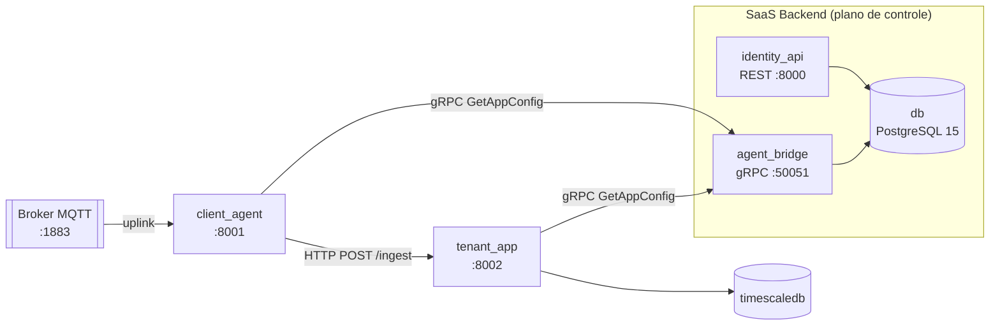
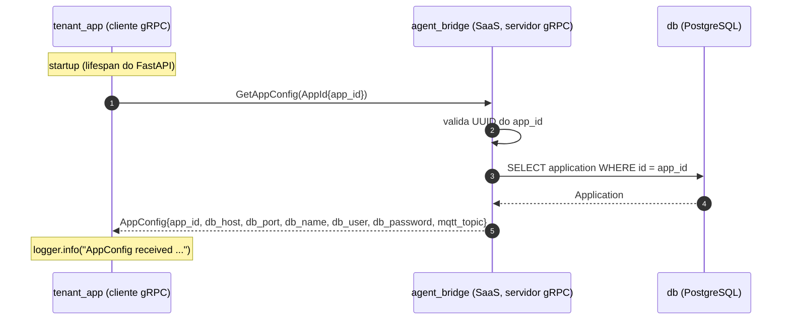
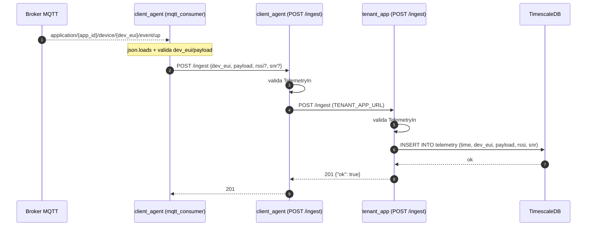

# Comunicação entre Serviços

> **Escopo deste documento:** como os serviços da plataforma se comunicam entre si —
> protocolos, contrato gRPC `AgentBridge`, fluxos de dados e configuração de rede. O
> contrato completo e os RPCs ainda não implementados estão descritos ao longo do
> documento.

---

## 1. Visão geral

A plataforma é um **sistema distribuído de serviços que conversam entre si**. A
orquestração é feita por um único `docker compose` (`deploy/docker-compose.yml`), que
coloca todos os serviços na mesma rede Docker e permite que se alcancem pelo **nome do
serviço** (resolução DNS interna do Compose).

Três protocolos sustentam a comunicação:

| Protocolo     | Uso                                                                               |
| :------------ | :-------------------------------------------------------------------------------- |
| **gRPC**      | Contrato binário `AgentBridge` — descoberta da configuração do tenant (`GetAppConfig`). |
| **HTTP/REST** | API do plano de controle (`identity_api`) e encaminhamento de telemetria (`POST /ingest`). |
| **MQTT**      | Ingestão de uplinks LoRaWAN publicados pelo ChirpStack.                          |

### 1.1 Serviços

| Serviço (Compose) | Tecnologia            | Porta           | Papel                                                                              |
| :---------------- | :-------------------- | :-------------- | :--------------------------------------------------------------------------------- |
| `identity_api`    | FastAPI (REST)        | `8000`          | API do plano de controle: CRUD de tenants e aplicações.                            |
| `agent_bridge`    | gRPC (`grpcio`)       | `50051`         | **Servidor** do contrato `AgentBridge` — responde `GetAppConfig`.                   |
| `client_agent`    | FastAPI               | `8001`          | Middleware compartilhado: entrada da ingestão e resolução de configuração de tenant. |
| `tenant_app`      | FastAPI               | `8002`          | Ambiente isolado por aplicação: busca a configuração via gRPC e persiste telemetria. |
| `db`              | PostgreSQL 15         | `5432` (interna) | Banco do plano de controle (tenants/applications).                                 |
| `timescaledb`     | TimescaleDB (pg14)    | `5432` (interna) | Série temporal isolada do tenant (hypertable `telemetry`).                          |

### 1.2 Topologia



---

## 2. Mapa de comunicação

Resumo de **quem fala com quem**, por qual protocolo e em que momento:

| Origem                          | Destino                          | Protocolo             | Porta   | Propósito                                              | Momento       |
| :------------------------------ | :------------------------------- | :-------------------- | :------ | :----------------------------------------------------- | :------------ |
| `tenant_app`                    | `agent_bridge`                   | gRPC                  | `50051` | `GetAppConfig(app_id)` — configuração do tenant        | startup       |
| `client_agent`                  | `agent_bridge`                   | gRPC                  | `50051` | `GetAppConfig` sob demanda (com cache) e health check  | startup / on-demand |
| Broker MQTT                     | `client_agent` (`mqtt_consumer`) | MQTT                  | `1883`  | Receber uplinks LoRaWAN                                | contínuo      |
| `client_agent` (`/ingest`)      | `tenant_app` (`/ingest`)         | HTTP/REST             | `8002`  | Encaminhar telemetria validada                         | por uplink    |
| `tenant_app`                    | `timescaledb`                    | PostgreSQL (`asyncpg`)| `5432`  | `INSERT` na hypertable `telemetry`                     | por ingest    |
| `agent_bridge` / `identity_api` | `db`                             | PostgreSQL            | `5432`  | Ler/escrever o plano de controle                       | contínuo      |
| Frontend / clientes externos    | `identity_api`                   | HTTP/REST             | `8000`  | CRUD de tenants e aplicações                           | sob demanda   |

> **Direção do gRPC:** o contrato é único (`AgentBridge`), mas cada lado hospeda o RPC
> que lhe cabe. O **SaaS** hospeda `GetAppConfig` (em `agent_bridge`) e o **tenant** é o
> cliente que o consome. Os demais RPCs do contrato ainda não estão implementados.

---

## 3. Contrato gRPC — `AgentBridge`

O contrato é versionado na raiz do repositório em [`proto/saas_agent.proto`](https://github.com/IncludeLuisFerreira/LINX-LoRaWAN-Intelligence-Nexus/blob/main/proto/saas_agent.proto)
e é **compartilhado** entre o SaaS Backend e o Client Agent. Os stubs Python são gerados
por `scripts/gen_proto.sh` para os pacotes `linx.grpc`, `agent.grpc` e `tenant.grpc`.

- **Pacote:** `linx`
- **Proto:** `proto3`
- **Serviço:** `AgentBridge`

### 3.1 RPCs

| RPC               | Request          | Response    | Direção                    | Status                              |
| :---------------- | :--------------- | :---------- | :------------------------- | :---------------------------------- |
| `GetAppConfig`    | `AppId`          | `AppConfig` | Cliente → SaaS             | **Implementado e em uso**           |
| `IngestTelemetry` | `TelemetryEvent` | `Ack`       | SaaS → Cliente             | Não implementado                    |
| `SyncRule`        | `Rule`           | `Ack`       | SaaS → Cliente             | Não implementado                    |
| `ReportViolation` | `Violation`      | `Ack`       | Cliente → SaaS             | Placeholder (retorna `ok=false`)    |

### 3.2 Mensagens do fluxo de configuração

**`AppId`** — identifica a aplicação (tenant) cuja configuração se deseja.

| Campo    | Tipo   | # | Descrição                         |
| :------- | :----- | :- | :-------------------------------- |
| `app_id` | string | 1 | Identificador UUID da aplicação.  |

**`AppConfig`** — configuração devolvida pelo SaaS.

| Campo         | Tipo   | # | Descrição                                                        |
| :------------ | :----- | :- | :--------------------------------------------------------------- |
| `app_id`      | string | 1 | Identificador UUID da aplicação.                                 |
| `db_host`     | string | 2 | Host do TimescaleDB do tenant.                                   |
| `db_port`     | uint32 | 3 | Porta do TimescaleDB.                                            |
| `db_name`     | string | 4 | Nome do banco do tenant.                                         |
| `db_user`     | string | 5 | Usuário do banco.                                                |
| `db_password` | string | 6 | Senha do banco.                                                  |
| `mqtt_topic`  | string | 7 | Tópico MQTT de assinatura (`application/{app_id}/device/+/event/up`). |

**`Ack`** — confirmação genérica usada pelos demais RPCs do contrato.

| Campo   | Tipo   | # | Descrição                                   |
| :------ | :----- | :- | :------------------------------------------ |
| `ok`    | bool   | 1 | `true` se a operação foi aceita.            |
| `error` | string | 2 | Mensagem de erro (vazia em caso de sucesso). |

---

## 4. Fluxo gRPC: `GetAppConfig`

Este é o fluxo de comunicação gRPC entre o tenant e o SaaS.

### 4.1 Sequência



### 4.2 Quem chama

**`tenant_app` (no startup).** Ao subir, o `tenant_app` abre um canal gRPC com
o SaaS (`SAAS_GRPC_HOST`) e chama `GetAppConfig(APP_ID)`. A resposta é registrada em log
como prova de comunicação. A chamada é **bloqueante** e executada fora do event loop
(`asyncio.to_thread`). Se falhar, o serviço **não cai**: apenas registra um `warning` e
segue operando com as variáveis de ambiente (`DB_*`).

**`client_agent` (conectividade e cache).** O middleware também possui um cliente gRPC.
No startup ele apenas valida a conectividade com o SaaS (`check_connectivity`) e expõe o
resultado em `GET /health`. Quando precisa da configuração de um tenant, resolve
`GetAppConfig(app_id)` **sob demanda**, com **cache de 60 s** (`CONFIG_CACHE_TTL_SECONDS`).

### 4.3 Resolução no servidor (`agent_bridge`)

O servicer `AgentBridgeServicer.GetAppConfig`:

1. Converte `request.app_id` para `UUID` — erro de formato → `INVALID_ARGUMENT`.
2. Consulta a tabela `application` no `db` do plano de controle.
3. Monta o `AppConfig` a partir da `DATABASE_URL` configurada no `agent_bridge` (host,
   porta, nome, usuário, senha) e deriva o `mqtt_topic` como
   `application/{app_id}/device/+/event/up`.

### 4.4 Exemplo de chamada e resposta

Request (`AppId`):

```text
app_id: "206b6a58-532c-47af-a4c9-258ddb171e73"
```

Response (`AppConfig`):

```text
app_id: "206b6a58-532c-47af-a4c9-258ddb171e73"
db_host: "db"
db_port: 5432
db_name: "linx"
db_user: "linx"
db_password: "<segredo>"
mqtt_topic: "application/206b6a58-532c-47af-a4c9-258ddb171e73/device/+/event/up"
```

Log esperado no `tenant_app` (`docker compose logs tenant_app`):

```text
INFO tenant.grpc_client AppConfig received app_id=206b6a58-... db_host=db db_port=5432 mqtt_topic=application/206b6a58-.../device/+/event/up
```

> Por segurança, `db_user`, `db_password` e `db_name` **não** são logados.
>
> No estado atual, os campos `db_*` refletem a `DATABASE_URL` do plano de controle
> configurada no `agent_bridge`. O `tenant_app` registra a resposta como prova de
> comunicação e continua montando seu pool do TimescaleDB a partir das variáveis
> `DB_*`; usar o `AppConfig` para isso ainda não está implementado.

### 4.5 Tratamento de erros

| Situação                                  | Status gRPC         | Comportamento                                                  |
| :---------------------------------------- | :------------------ | :------------------------------------------------------------- |
| `app_id` não é UUID válido                | `INVALID_ARGUMENT`  | `tenant_app`/`client_agent` loga erro e segue (degradação graciosa). |
| Aplicação não encontrada                  | `NOT_FOUND`         | Idem.                                                          |
| `db` indisponível                         | `UNAVAILABLE`       | Idem.                                                          |
| SaaS inacessível / timeout                | `UNAVAILABLE`       | `client_agent` marca `saas_grpc: false` em `/health`.          |

Em todos os casos o serviço **não** deixa de subir — a configuração vinda por env é
mantida como fallback.

### 4.6 Segurança

O canal gRPC é **inseguro** (`grpc.insecure_channel`) e o `AppConfig` trafega
`db_password` em texto plano. O endpoint `50051` do `agent_bridge` deve ser restrito no
Security Group ao IP do `client_agent`/`tenant_app` — **nunca** `0.0.0.0/0`. TLS/mTLS
entre os serviços ainda não está implementado.

---

## 5. Fluxo de ingestão de telemetria

Fecha o caminho do dado: `Broker MQTT → client_agent → tenant_app → TimescaleDB`.

### 5.1 Sequência



### 5.2 Schema da telemetria (`TelemetryIn`)

| Campo     | Tipo              | Obrigatório | Descrição                                  |
| :-------- | :---------------- | :---------- | :----------------------------------------- |
| `dev_eui` | string (`min=1`)  | sim         | Identificador do dispositivo LoRaWAN.      |
| `payload` | objeto (JSON)     | sim         | Payload decodificado do sensor.            |
| `rssi`    | inteiro           | não         | Intensidade do sinal.                      |
| `snr`     | número            | não         | Relação sinal-ruído.                       |

Persistência no `tenant_app` (query parametrizada via `asyncpg`):

```sql
INSERT INTO telemetry (time, dev_eui, payload, rssi, snr)
VALUES (NOW(), $1, $2::jsonb, $3, $4)
```

### 5.3 Códigos de status

| Camada             | Código | Significado                                                        |
| :----------------- | :----- | :----------------------------------------------------------------- |
| `client_agent`     | `201`  | Telemetria encaminhada e persistida com sucesso.                   |
| `client_agent`     | `422`  | Payload inválido (repassado do `tenant_app`).                      |
| `client_agent`     | `502`  | `tenant_app` inalcançável, timeout ou `5xx` no upstream.           |
| `client_agent`     | `503`  | Cliente HTTP interno indisponível.                                 |
| `tenant_app`       | `201`  | Linha inserida na hypertable `telemetry`.                          |
| `tenant_app`       | `422`  | Payload inválido.                                                  |
| `tenant_app`       | `503`  | Pool de conexões do TimescaleDB indisponível.                      |
| `tenant_app`       | `500`  | Falha ao inserir no banco.                                         |

O `mqtt_consumer` **nunca** lança exceção para fora do callback: JSON inválido ou campos
obrigatórios ausentes geram `warning` e a mensagem é ignorada; falha no `POST` gera
`error`. O loop MQTT não quebra.

> **Status de execução:** o pipeline está implementado e é exercitado com
> `mosquitto_pub` + consumer. No `deploy/docker-compose.yml` o contêiner `client_agent`
> sobe apenas o middleware FastAPI (`uvicorn agent.main:app`); o broker MQTT e o
> `mqtt_consumer` (`python -m agent.mqtt_consumer`) rodam a partir da stack `infra/` e
> de um processo separado, apontando `INGEST_URL` para o `client_agent`. A ingestão
> também pode ser validada diretamente por `curl POST /ingest`.

---

## 6. Fluxo REST — `identity_api`

O plano de controle expõe a API REST consumida pelo frontend e por integrações. É o
primeiro ponto de comunicação de um cliente com a plataforma.

| Método   | Rota                                                  | Descrição                            |
| :------- | :---------------------------------------------------- | :----------------------------------- |
| `GET`    | `/health`                                             | Health check (`200`).                |
| `POST`   | `/api/v1/tenant/`                                     | Cria um tenant (`201` + `id` UUID).  |
| `GET`    | `/api/v1/tenant/`                                     | Lista tenants.                       |
| `GET`    | `/api/v1/tenant/{id}`                                 | Busca tenant por `id`.               |
| `PATCH`  | `/api/v1/tenant/{id}`                                 | Atualiza tenant.                     |
| `DELETE` | `/api/v1/tenant/{id}`                                 | Remove tenant (`204`).               |
| `POST`   | `/api/v1/tenant/{id}/applications`                    | Cria application no tenant.          |
| `GET`    | `/api/v1/tenant/{id}/applications`                    | Lista applications do tenant.        |
| `GET`    | `/api/v1/tenant/{id}/applications/{app_id}`           | Busca application.                   |
| `PATCH`  | `/api/v1/tenant/{id}/applications/{app_id}`           | Atualiza application.                |
| `DELETE` | `/api/v1/tenant/{id}/applications/{app_id}`           | Remove application (`204`).          |

O `id` e o `app_id` são `UUID` v4 gerados pelo banco. O `app_id` criado aqui é o mesmo
`APP_ID` usado pelo `tenant_app` para buscar a configuração via gRPC.

---

## 7. Variáveis de ambiente de comunicação

As variáveis que **ligam os serviços** entre si (arquivos `.env.example` de cada módulo e
`deploy/.env`):

| Variável                 | Serviço                    | Exemplo                                    | Descrição                                                        |
| :----------------------- | :------------------------- | :----------------------------------------- | :--------------------------------------------------------------- |
| `SAAS_GRPC_HOST`         | `tenant_app`, `client_agent` | `agent_bridge:50051`                     | Endereço do servidor gRPC do SaaS.                               |
| `GRPC_PORT`              | `agent_bridge`             | `50051`                                    | Porta de bind do servidor gRPC.                                  |
| `GRPC_TIMEOUT_SECONDS`   | `client_agent`, `tenant_app` | `5`                                      | Timeout das chamadas gRPC.                                       |
| `CONFIG_CACHE_TTL_SECONDS` | `client_agent`           | `60`                                       | TTL do cache de `GetAppConfig`.                                  |
| `TENANT_APP_URL`         | `client_agent`             | `http://tenant_app:8002`                   | Destino do encaminhamento de telemetria.                         |
| `INGEST_URL`             | `mqtt_consumer`            | `http://client_agent:8001/ingest`          | Destino do `POST` do consumer MQTT.                              |
| `CLIENT_AGENT_URL`       | `tenant_app`               | `http://client_agent:8001`                 | Endereço do middleware compartilhado.                            |
| `APP_ID`                 | `tenant_app`               | `206b6a58-...`                             | Identidade da aplicação usada no `GetAppConfig`.                 |
| `MQTT_TOPIC`             | `tenant_app`               | `application/+/device/+/event/up`          | Tópico MQTT de uplink.                                           |
| `DB_HOST` / `DB_PORT`    | `tenant_app`               | `timescaledb` / `5432`                     | Conexão com o TimescaleDB.                                       |
| `DB_USER` / `DB_PASSWORD` / `DB_NAME` | `tenant_app`, `timescaledb` | `tenant` / `...` / `tenantdb` | Credenciais do banco do tenant.                                  |
| `DATABASE_URL`           | `agent_bridge`, `identity_api` | `postgresql+psycopg://...@db:5432/linx` | Banco do plano de controle.                                      |

> Em containers, os hosts são **nomes de serviço do Compose** (`db`, `agent_bridge`,
> `tenant_app`), não `localhost`.

---

## 8. Como verificar

```bash
# 1. Subir toda a stack
cd deploy
docker compose up -d --build
docker compose ps                       # todos os serviços "Up"

# 2. Prova do gRPC: AppConfig recebido do SaaS no startup do tenant_app
docker compose logs tenant_app | grep "AppConfig received"

# 3. Prova do REST: criar um tenant no banco do plano de controle
curl -i -X POST localhost:8000/api/v1/tenant/ \
  -H 'Content-Type: application/json' \
  -d '{"name": "ACME"}'

# 4. Prova da ingestão: persistir telemetria no TimescaleDB do tenant
curl -i -X POST localhost:8001/ingest \
  -H 'Content-Type: application/json' \
  -d '{"dev_eui": "dev1", "payload": {"temperature": 25.5}, "rssi": -70, "snr": 7.5}'
# esperado: 201 {"ok": true}
```

Verificação alternativa da ingestão via MQTT (com o broker da stack `infra/`):

```bash
mosquitto_pub -h localhost -p 1883 \
  -t "application/1/device/dev1/event/up" \
  -m '{"dev_eui":"dev1","payload":{"temperature":25.5}}'
```

---

## 9. RPCs do contrato ainda não implementados

Os RPCs abaixo já estão definidos no contrato `AgentBridge`, mas ainda **não** estão
implementados:

| RPC               | Objetivo                                                            |
| :---------------- | :------------------------------------------------------------------ |
| `IngestTelemetry` | Roteamento de telemetria do SaaS para o contêiner do tenant.        |
| `SyncRule`        | Replicar regras de negócio do SaaS para o motor de regras do tenant. |
| `ReportViolation` | Notificar o SaaS quando uma regra é violada no tenant.              |
